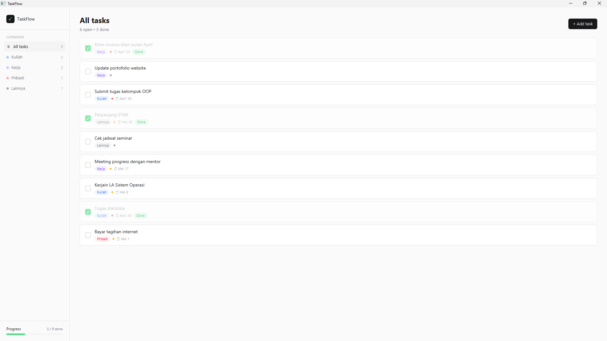

# TaskFlow (Re-Design)

> Aplikasi To-Do List desktop berbasis Java yang minimal, fokus, dan ramah pengguna untuk mahasiswa serta profesional.

TaskFlow adalah aplikasi manajemen tugas desktop yang dibangun dengan **Java + JavaFX** dan mengikuti pola arsitektur **MVC**. Aplikasi ini memungkinkan pengguna mencatat tugas, memberi kategori (Kuliah, Kerja, Pribadi, Lainnya), menetapkan prioritas (High, Medium, Low), serta memantau progres penyelesaian. Seluruh data disimpan secara otomatis ke berkas [`taskflow_data.json`](taskflow/taskflow_data.json) lokal melalui pustaka **Gson**, sehingga data tetap aman antar sesi tanpa memerlukan basis data eksternal.



---

## Fitur Utama

- **Tambah Tugas** — modal khusus dengan validasi judul wajib, pemilih kategori dan prioritas berbasis chip, serta input deadline opsional.
- **Hapus Tugas** — disertai dialog konfirmasi (`Delete this task?`) untuk mencegah penghapusan tidak sengaja.
- **Tandai Selesai / Belum Selesai** — checkbox di setiap kartu tugas mengubah status `isCompleted` secara langsung.
- **Filter berdasarkan Kategori** — sidebar menampilkan daftar kategori dengan jumlah tugas terbuka per kategori; klik untuk memfilter daftar.
- **Indikator Progres** — progress bar di bagian bawah sidebar menampilkan rasio `completedCount / totalCount` dalam persen.
- **Persistensi Otomatis** — setiap perubahan data (tambah, hapus, toggle) langsung disimpan ke `taskflow_data.json`.
- **Empty State** — tampilan khusus saat daftar kosong, lengkap dengan tombol "Add task" sebagai shortcut.
- **Desain System Konsisten** — palet warna, tipografi, spacing, dan radius mengikuti TaskFlow Design System (terinspirasi Notion/Linear).

---

## Tech Stack

| Komponen | Teknologi | Versi |
|---|---|---|
| Bahasa | Java | 17+ (target source/target 17) |
| UI Framework | JavaFX (Controls, Graphics) | 21.0.2 |
| Build Tool | Apache Maven | 3.9.x |
| JSON Library | Google Gson | 2.10.1 |
| Plugin Run | `javafx-maven-plugin` | 0.0.8 |
| Compiler Plugin | `maven-compiler-plugin` | 3.13.0 |

---

## Quick Start

**Prasyarat:** JDK 17 atau lebih baru, Maven 3.9+, dan koneksi internet (untuk unduhan dependensi pertama kali).

```bash
# 1. Pindah ke direktori proyek
cd taskflow

# 2. Compile (opsional, dilakukan otomatis oleh javafx:run)
mvn -q compile

# 3. Jalankan aplikasi
mvn javafx:run
```

Berkas data `taskflow_data.json` akan dibuat otomatis di direktori kerja saat pertama kali sebuah tugas ditambahkan.

---

## Struktur Proyek

```
taskflow/
├── pom.xml
├── src/
│   └── main/
│       ├── java/
│       │   └── com/taskflow/
│       │       ├── Main.java
│       │       ├── controller/
│       │       │   └── TaskController.java
│       │       ├── manager/
│       │       │   └── TaskManager.java
│       │       ├── model/
│       │       │   ├── Category.java
│       │       │   ├── Priority.java
│       │       │   └── Task.java
│       │       ├── persistence/
│       │       │   └── JsonStorage.java
│       │       └── view/
│       │           ├── AddTaskModal.java
│       │           ├── EmptyStateView.java
│       │           ├── MainView.java
│       │           ├── SidebarView.java
│       │           ├── TaskCardView.java
│       │           └── TaskListView.java
│       └── resources/
│           └── taskflow.css
```

---

## Lisensi

Proyek ini dirilis untuk keperluan pembelajaran akademik. <br>Lihat berkas [LICENSE](LICENSE) jika tersedia, atau sesuaikan dengan kebijakan kelas Anda.
